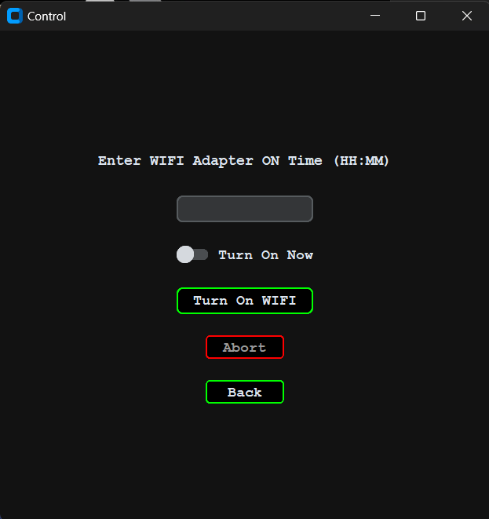

# Control

## Introduction

Name of the application is Control. The main use of the application is to control the main functions such as shutdown, restart, sleep, wifi on/off on a given time.

This Desktop application works for windows os based devices.

### The problem I wanted to solve

When downloading content from internet we use time based internet packages. Mostly, the package will be over at 8.30 in the morning. If you do not pause the downloading when the package is over your limited data from other data plans will be consumed and if you are not a morning person you probably have to wakeup and pause the download manually.

### Solution

So, to solve this problem I made this app to turn off the wifi at a given time. So, as a not so much of a morning person I dont have to wake up and do the pausing manually! :joy:

## Functionalities

I added some extra functionalities which could be useful.

- Shutdown Function
The Computer could be shutdowned at any given time.

- Restart Function
The computer could be restarted at any given time

- Sleep Funciton

- WIFI Off/On Function
The wifi adapter will be on/off acoording to a given time

![The interface of the application. Functions in order [shutdown, restart, sleep, wifi on, wifi off]](image.png)

### Rules

1. *If a options such as shutdown, restart or sleep operation is executed it would disable the other two options. You should abort the current execution to enable the other options*
Ex - If shutdown command is executed restart and sleep options would be unavailable.

2. *If a options such as shutdown, restart or sleep operation is executed the wifi on or off time should be before the main operation execution time*
Ex - if restart command is executed then the time for turning wifi on or off should be before the main operation execution time.

## Important

1. *WIFI* - When the wifi is turned off it turns off the wifi adapter. Do not be afraid you could easily turn it back on using the wifi turn on option. And it could be done immediately by toggling the *'Wifi on Now'* option.

 

### Installation of the application

1. You could install the required packages uisng the command below

    >`pip install -r requirements.txt`

2. Go the directory and execute this command to run the application

    >`python app.py`
